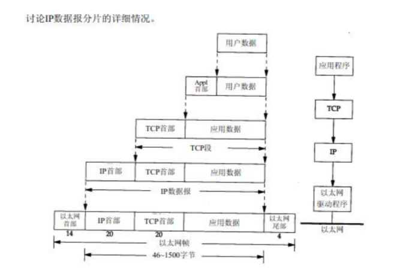

# 计算机网络

## tcp/ip协议

### **四层模型**
1. 链路层
  `ARP`  `RARP`
1. 网络层
   `IP` `ICMP` `IGMP`
1. 传输层
   `UDP` `TCP`
1. 应用层
   `HTTP` `DNS` `HTTPS`

### **封装**
+ 以太网数据帧的物理特性是其`**长度必须在46-1500字节**`
+ 以太网的帧首部也有一个`16bit的帧类型域(ip, arp, rarp)`
+ IP在首部有`一个8bit的协议域(icmp, igmp, tcp, udp, esp, gre)`
+ TCP和UDP都用`一个16bit的端口号表示不同应用程序(ftp, telnet, http)`

数据封装: 

