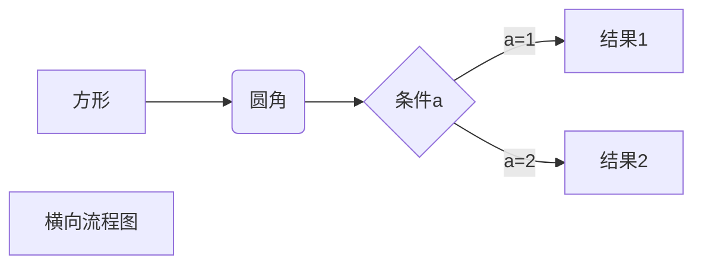

# 计算机网络

## tcp/ip协议

### **四层模型**
1. 链路层
  `ARP`  `RARP`
1. 网络层
   `IP` `ICMP` `IGMP`
1. 传输层
   `UDP` `TCP`
1. 应用层
   `HTTP` `DNS` `HTTPS`

### **springboot**
1. [springboot系列文章之启动原理详解](https://juejin.im/post/5b79a6e651882542aa1b2c22)

