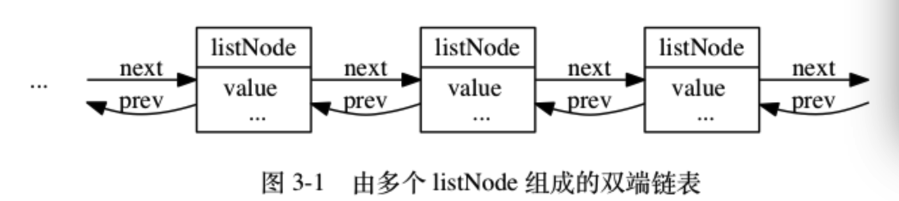
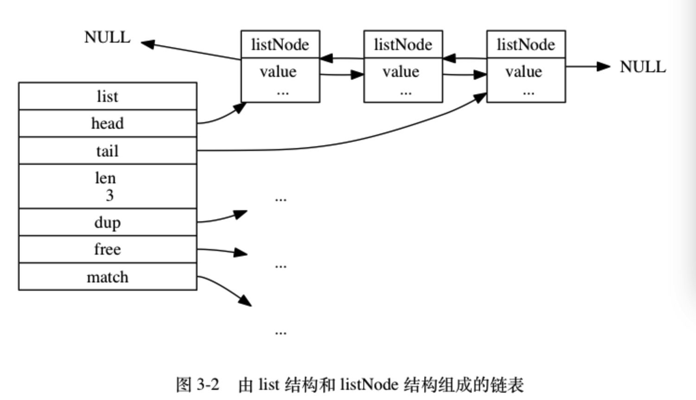
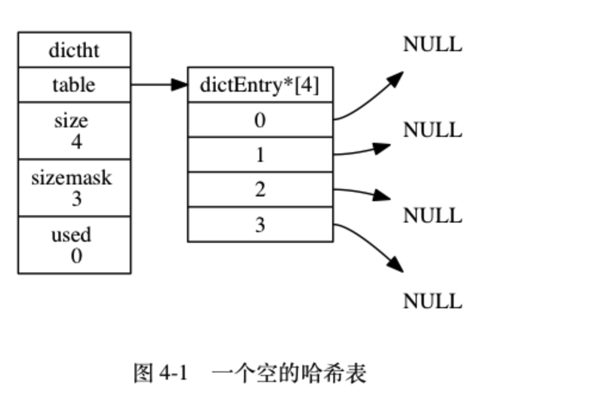
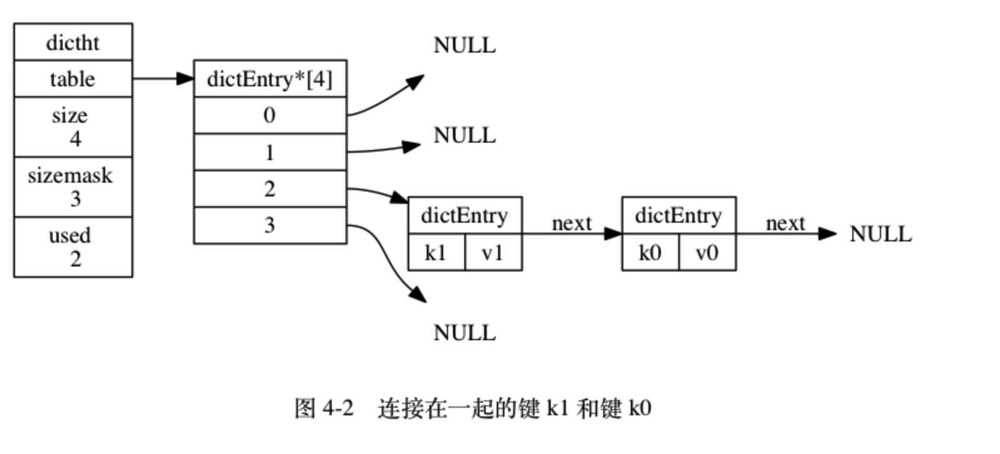
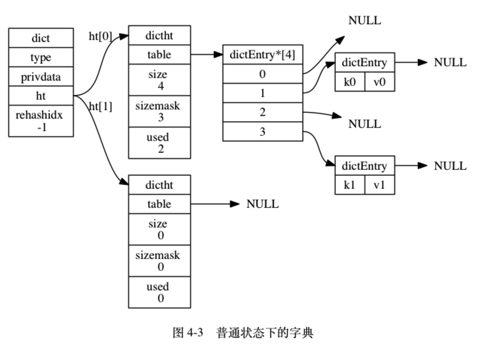
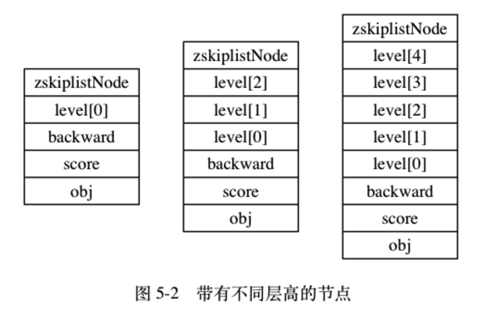
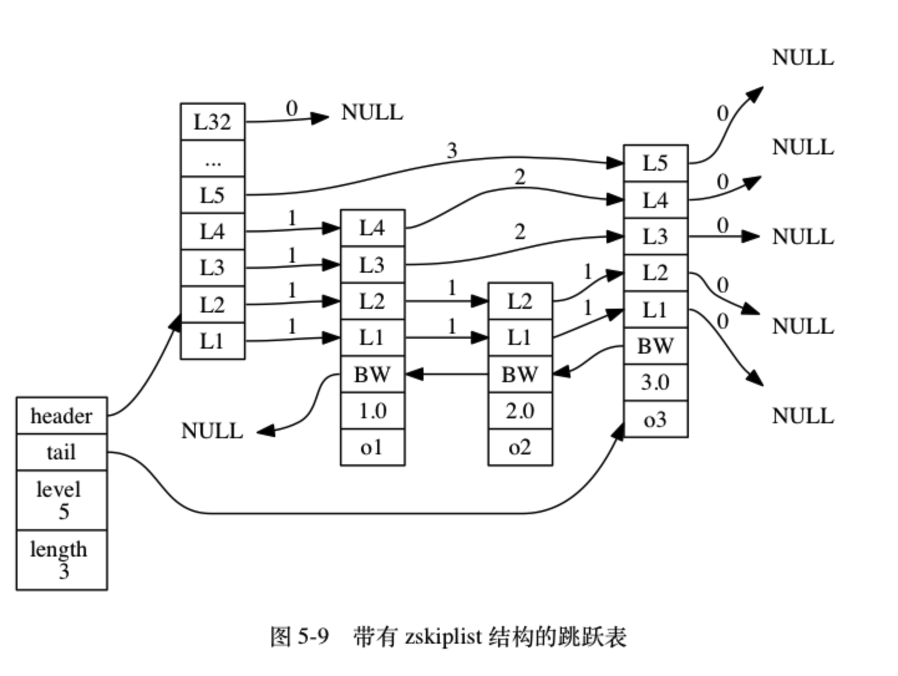
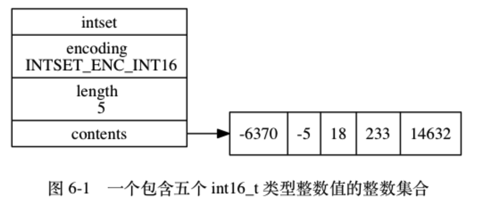
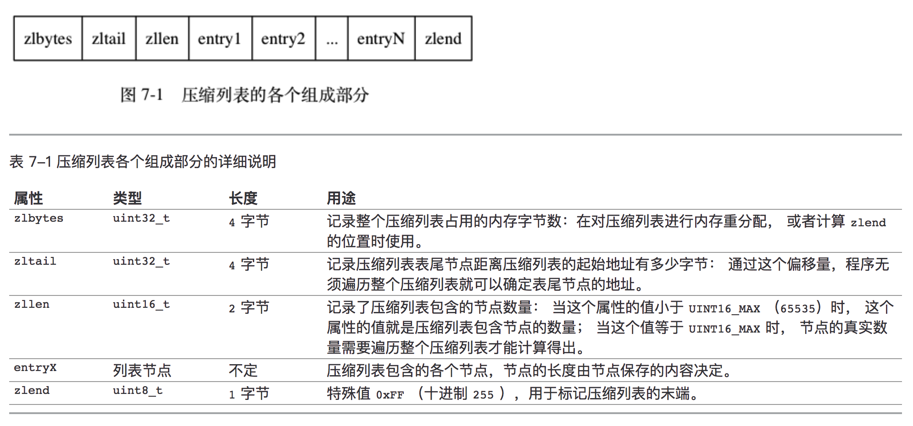

## redis的数据结构与对象
+ 简单动态字符串  
+ 链表
+ 字典
+ 跳跃表
+ 整数集合  
+ 压缩列表  
+ 对象  

### 1. 简单动态字符串

    struct sdshdr {
    
        // 记录 buf 数组中已使用字节的数量
        // 等于 SDS 所保存字符串的长度
        int len;
    
        // 记录 buf 数组中未使用字节的数量
        int free;
    
        // 字节数组，用于保存字符串
        char buf[];
    
    };

### 2. 链表

    typedef struct listNode {
    
        // 前置节点
        struct listNode *prev;
    
        // 后置节点
        struct listNode *next;
    
        // 节点的值
        void *value;
    
    } listNode;  
    
    

节点图:   

    typedef struct list {
    
        // 表头节点
        listNode *head;
    
        // 表尾节点
        listNode *tail;
    
        // 链表所包含的节点数量
        unsigned long len;
    
        // 节点值复制函数
        void *(*dup)(void *ptr);
    
        // 节点值释放函数
        void (*free)(void *ptr);
    
        // 节点值对比函数
        int (*match)(void *ptr, void *key);
    
    } list;
    

图表: 

### 3. 字典
哈希表:

    typedef struct dictht {
    
        // 哈希表数组
        dictEntry **table;
    
        // 哈希表大小
        unsigned long size;
    
        // 哈希表大小掩码，用于计算索引值
        // 总是等于 size - 1
        unsigned long sizemask;
    
        // 该哈希表已有节点的数量
        unsigned long used;
    
    } dictht;

图: 

哈希表节点:

    typedef struct dictEntry {
    
        // 键
        void *key;
    
        // 值
        union {
            void *val;
            uint64_t u64;
            int64_t s64;
        } v;
    
        // 指向下个哈希表节点，形成链表
        struct dictEntry *next;
    
    } dictEntry;

图:  

字典:

    typedef struct dict {
    
        // 类型特定函数
        dictType *type;
    
        // 私有数据
        void *privdata;
    
        // 哈希表
        dictht ht[2];
    
        // rehash 索引
        // 当 rehash 不在进行时，值为 -1
        int rehashidx; /* rehashing not in progress if rehashidx == -1 */
    
    } dict;

字典的dictType

    typedef struct dictType {
    
        // 计算哈希值的函数
        unsigned int (*hashFunction)(const void *key);
    
        // 复制键的函数
        void *(*keyDup)(void *privdata, const void *key);
    
        // 复制值的函数
        void *(*valDup)(void *privdata, const void *obj);
    
        // 对比键的函数
        int (*keyCompare)(void *privdata, const void *key1, const void *key2);
    
        // 销毁键的函数
        void (*keyDestructor)(void *privdata, void *key);
    
        // 销毁值的函数
        void (*valDestructor)(void *privdata, void *obj);
    
    } dictType;
       
图:      

### 4. 跳跃表
跳跃表节点：

    typedef struct zskiplistNode {
    
        // 后退指针
        struct zskiplistNode *backward;
    
        // 分值
        double score;
    
        // 成员对象
        robj *obj;
    
        // 层
        struct zskiplistLevel {
    
            // 前进指针
            struct zskiplistNode *forward;
    
            // 跨度
            unsigned int span;
    
        } level[];
    
    } zskiplistNode;

图:    
    
跳跃表：

    typedef struct zskiplist {
    
        // 表头节点和表尾节点
        struct zskiplistNode *header, *tail;
    
        // 表中节点的数量
        unsigned long length;
    
        // 表中层数最大的节点的层数
        int level;
    
    } zskiplist;

图:   

### 5. 整数集合
整数节后：

    typedef struct intset {
    
        // 编码方式
        uint32_t encoding;
    
        // 集合包含的元素数量
        uint32_t length;
    
        // 保存元素的数组
        int8_t contents[];
    
    } intset;

图:     

### 6. 压缩列表（ziplist）  
> ziplist是**列表键**和**哈希键**的底层实现之一。 
> 
> 当一个列表键只包含**少量**列表项， 并且每个列表项要么就是**小整数值**， 要么就是长度比**较短的字符串**， 那么 Redis 就会使用压缩列表来做列表键的底层实现。

图:  
 
图:   

### 7. 对象
> Redis基于这些数据结构创建了一个**对象系统**， 这个系统包含**字符串对象**、**列表对象**、**哈希对象**、**集合对象**和**有序集合对象**这五种类型的对象。  

每个对象都由一个 redisObject 结构表示：  

    typedef struct redisObject {
    
        // 类型
        unsigned type:4;
        
        // 编码
        unsigned encoding:4;
        
        // 指向底层实现数据结构的指针
        void *ptr;
        
    } robj;  

***
    
对象的类型：  

类型常量         |   对象的名称 
---             |   --- 
REDIS_STRING    |	字符串对象
REDIS_LIST	    |   列表对象
REDIS_HASH	    |   哈希对象
REDIS_SET	    |   集合对象
REDIS_ZSET	    |   有序集合对象

对一个数据库键执行 TYPE 命令时， 命令返回的结果为数据库键对应的值对象的类型， 而不是键对象的类型：

    redis> SET msg 'hello world'
    OK
    redis> TYPE msg
    string

***

表: 对象的编码  

编码常量	                    |   编码所对应的底层数据结构
---                         |   ---
REDIS_ENCODING_INT          |	long 类型的整数
REDIS_ENCODING_EMBSTR       |	embstr 编码的简单动态字符串
REDIS_ENCODING_RAW          |	简单动态字符串
REDIS_ENCODING_HT           |	字典
REDIS_ENCODING_LINKEDLIST   |	双端链表
REDIS_ENCODING_ZIPLIST	    |   压缩列表
REDIS_ENCODING_INTSET       |	整数集合
REDIS_ENCODING_SKIPLIST     |	跳跃表和字典

表：不同类型和编码的对象

类型             |	编码                         |	对象
---             |   ---                         |   ---
REDIS_STRING    |	REDIS_ENCODING_INT          |	使用整数值实现的字符串对象。
REDIS_STRING    |	REDIS_ENCODING_EMBSTR       |	使用 embstr 编码的简单动态字符串实现的字符串对象。
REDIS_STRING    |	REDIS_ENCODING_RAW          |	使用简单动态字符串实现的字符串对象。
REDIS_LIST      |	REDIS_ENCODING_ZIPLIST      |	使用压缩列表实现的列表对象。
REDIS_LIST      |	REDIS_ENCODING_LINKEDLIST   |	使用双端链表实现的列表对象。
REDIS_HASH      |	REDIS_ENCODING_ZIPLIST      |	使用压缩列表实现的哈希对象。
REDIS_HASH      |	REDIS_ENCODING_HT           |	使用字典实现的哈希对象。
REDIS_SET       |	REDIS_ENCODING_INTSET       |	使用整数集合实现的集合对象。
REDIS_SET       |	REDIS_ENCODING_HT           |	使用字典实现的集合对象。
REDIS_ZSET      |	REDIS_ENCODING_ZIPLIST      |	使用压缩列表实现的有序集合对象。
REDIS_ZSET      |	REDIS_ENCODING_SKIPLIST     |	使用跳跃表和字典实现的有序集合对象。

使用 OBJECT ENCODING 命令可以查看一个数据库键的值对象的编码：

    redis> SET msg "hello wrold"
    OK
    
    redis> OBJECT ENCODING msg
    "embstr"
    
***

#### 7.1 字符串对象
字符串对象的编码可以是 int 、 raw 或者 embstr 。  

+ int: 字符串对象保存的是整数值， 并且这个整数值可以用 long 类型来表示  
+ embstr(只读的): 字符串值的长度小于等于 39 字节, 简单动态字符串（SDS）  
+ raw: 字符串值的长度大于 39 字节, 使用一个简单动态字符串（SDS） 

#### 7.2 列表对象
列表对象的编码可以是 ziplist 或者 linkedlist。  

+ ziplist: 使用压缩列表作为底层实现， 每个压缩列表节点（entry）保存了一个列表元素  
+ linkedlist: 使用双端链表作为底层实现， 每个双端链表节点（node）都保存了一个字符串对象， 而每个字符串对象都保存了一个列表元素。  

##### 编码转换
> 当列表对象可以同时满足以下两个条件时， 列表对象使用 ziplist 编码：
> 
> 1. 列表对象保存的所有字符串元素的长度都小于 64 字节；  
> 1. 列表对象保存的元素数量小于 512 个；  

**注意**， linkedlist 编码的列表对象在底层的双端链表结构中包含了多个字符串对象， 这种嵌套字符串对象的行为在稍后介绍的哈希对象、集合对象和有序集合对象中都会出现， **字符串对象**是 Redis 五种类型的对象中**唯一**一种会被其他四种类型对象嵌套的对象  

#### 7.3 哈希对象
哈希对象的编码可以是 ziplist 或者 hashtable 。

##### ziplist, 先将保存了键的压缩列表节点推入到压缩列表表尾， 然后再将保存了值的压缩列表节点推入到压缩列表表尾:  
+ 保存了同一键值对的两个节点总是紧挨在一起， 保存键的节点在前， 保存值的节点在后；  
+ 先添加到哈希对象中的键值对会被放在压缩列表的表头方向， 而后来添加到哈希对象中的键值对会被放在压缩列表的表尾方向。 

##### hashtable, 哈希对象中的每个键值对都使用一个字典键值对来保存：
+ 字典的每个键都是一个字符串对象， 对象中保存了键值对的键；  
+ 字典的每个值都是一个字符串对象， 对象中保存了键值对的值。  

##### 编码转换
> 当哈希对象可以同时满足以下两个条件时， 哈希对象使用 ziplist 编码：
>
> 1. 哈希对象保存的所有键值对的键和值的字符串长度都小于 64 字节；  
> 1. 哈希对象保存的键值对数量小于 512 个；  

#### 7.4 哈希对象
集合对象的编码可以是 intset 或者 hashtable

+ intset 编码的集合对象使用整数集合作为底层实现， 集合对象包含的所有元素都被保存在整数集合里面  
+ hashtable 编码的集合对象使用字典作为底层实现， 字典的每个键都是一个字符串对象， 每个字符串对象包含了一个集合元素， 而字典的值则全部被设置为 NULL  

##### 编码转换
> 当集合对象可以同时满足以下两个条件时， 对象使用 intset 编码：
>
> 1. 集合对象保存的所有元素都是整数值；  
> 1. 集合对象保存的元素数量不超过 512 个；  

#### 7.5 有序集合对象
有序集合的编码可以是 ziplist 或者 skiplist 。

+ ziplist 编码的有序集合对象使用压缩列表作为底层实现， 每个集合元素使用两个紧挨在一起的压缩列表节点来保存， 第一个节点保存元素的成员（member）， 而第二个元素则保存元素的分值（score）。  
+ skiplist 编码的有序集合对象使用 zset 结构作为底层实现， 一个 zset 结构同时包含一个字典和一个跳跃表  

##### 编码的转换
> 当有序集合对象可以同时满足以下两个条件时， 对象使用 ziplist 编码：
>
> 1. 有序集合保存的元素数量小于 128 个；  
> 1. 有序集合保存的所有元素成员的长度都小于 64 字节；  

