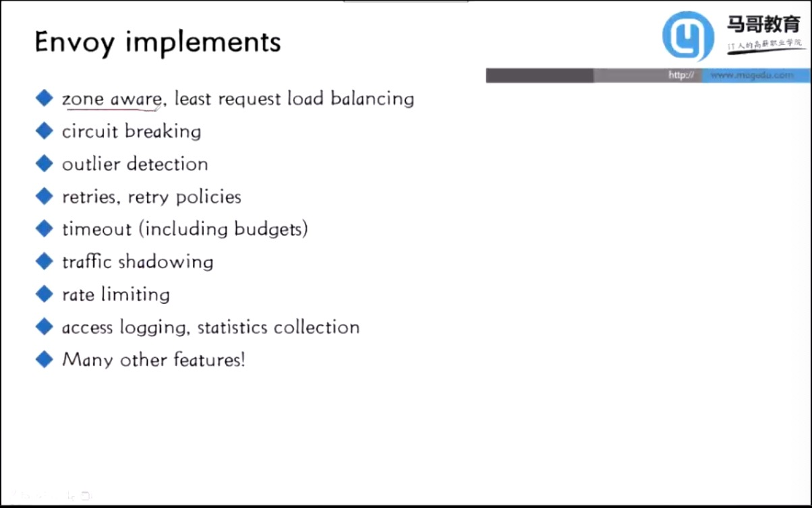
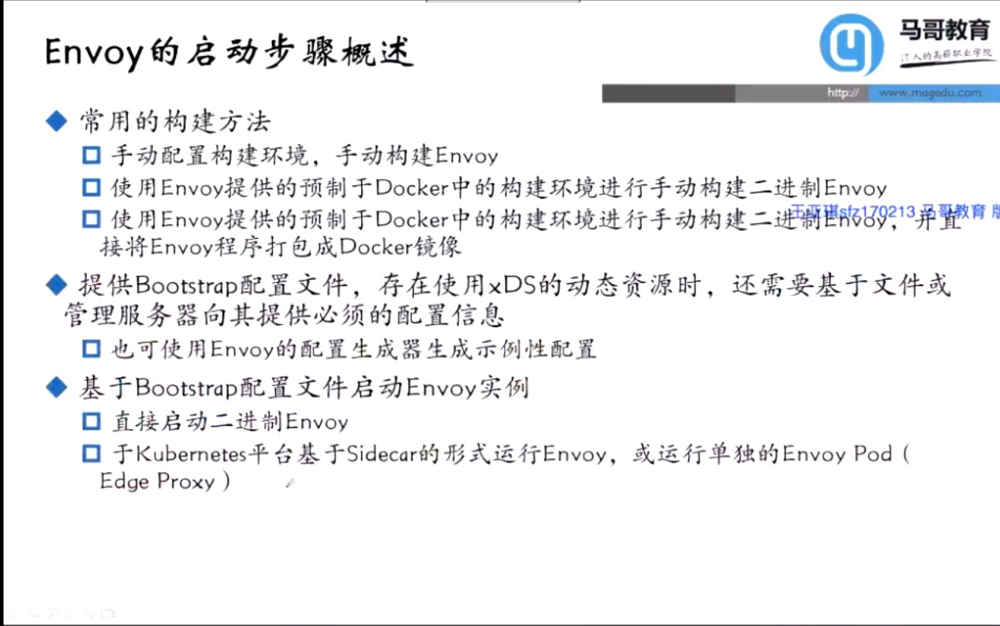

## 01outline

1. Service Mesh Basics
1. Envoy Basics
1. 基础配置及应用
1. xDS协议及API动态配置
1. 层级化运行时
1. 服务韧性
1. 流量治理
1. 分布式追踪
1. Istio基础
1. Istio实践

--- 

## 02servcieMesh

### 微服务治理面临的挑战

### 服务网格
- 概念：专注于处理服务间通信的基础设施，它负责在现代云原生应用组成的复杂拓扑中可靠的传递请求
- 治理模式：除了处理业务逻辑的相关功能外，还包括此前单体应用中的网络通信、熔断、限流、跟踪等
- 实现模式
    - 内嵌于应用程序
    - SDK
    - Sidecar

---

## 03EnvoyArch

### 什么是Envoy

Envoy是一个L7代理和连接总线，用于现代大型面向服务架构

### Envoy组件拓扑

### Envoy xDS核心术语

### Envoy部署类型

### Envoy核心配置组件

### Envoy线程模型和连接处理机制

---

## 04EnvoyTheory

---

## 05xDS

---

## 06EnvoyInit的入门使用

### Envoy安装概况

### Building Envoy with Bazel

### Envoy的第一个实例(50m)

 
---

## EnvoyLayer4

### Cluster简易静态配置

### Cluster简易静态配置示例

### L4过滤器tcp_proxy

### TCP代理配置示例

### 运行的示例
1. envoy.yaml
    

1. docker-compose.yaml(模拟sidecar)
    

## 34istio
 
 ### 介绍

 ### 为什么

 ### 功能

 ### 是什么

 ### 为什么要用istio

 ### istio系统架构

### Pilot

### Mixer

### istio的安全模型

### Citadel

### Galley

### Ingress Gateway 和 Egress Gateway

### Sidecar Injector

### 可视化

## 35 istio install

### 本节话题

### 示例集群

### 快速安装

// istioctl manifest generate --set profile=demo >/tmp/demo.yaml

// istioctl verify-install [-f /tmp/demo.yaml]

## 36istioDemo

