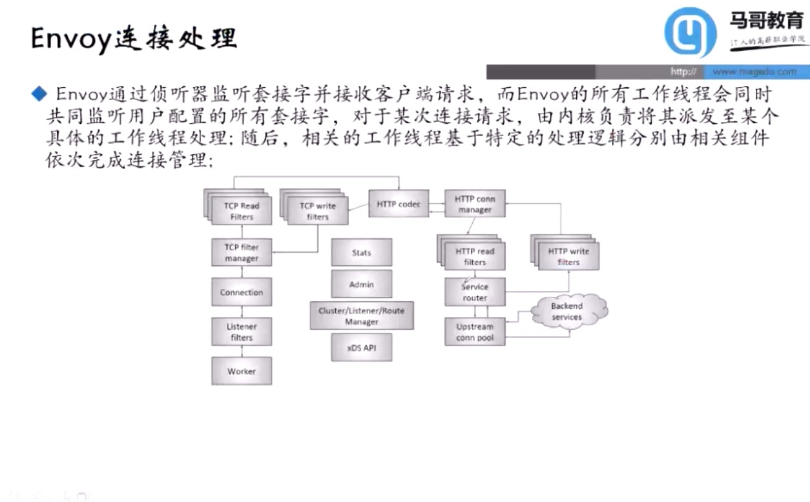

## 01outline

1. Service Mesh Basics
1. Envoy Basics
1. 基础配置及应用
1. xDS协议及API动态配置
1. 层级化运行时
1. 服务韧性
1. 流量治理
1. 分布式追踪
1. Istio基础
1. Istio实践

--- 

## 02servcieMesh

### 微服务治理面临的挑战

### 服务网格
- 概念：专注于处理服务间通信的基础设施，它负责在现代云原生应用组成的复杂拓扑中可靠的传递请求
- 治理模式：除了处理业务逻辑的相关功能外，还包括此前单体应用中的网络通信、熔断、限流、跟踪等
- 实现模式
    - 内嵌于应用程序
    - SDK
    - Sidecar

---

## 03EnvoyArch

### 什么是Envoy

Envoy是一个L7代理和连接总线，用于现代大型面向服务架构

### Envoy组件拓扑

### Envoy xDS核心术语

### Envoy部署类型

### Envoy核心配置组件

### Envoy线程模型和连接处理机制

---

## 04EnvoyTheory

---

## 05xDS

---

## 06EnvoyInit的入门使用

### Envoy安装概况

### Building Envoy with Bazel

