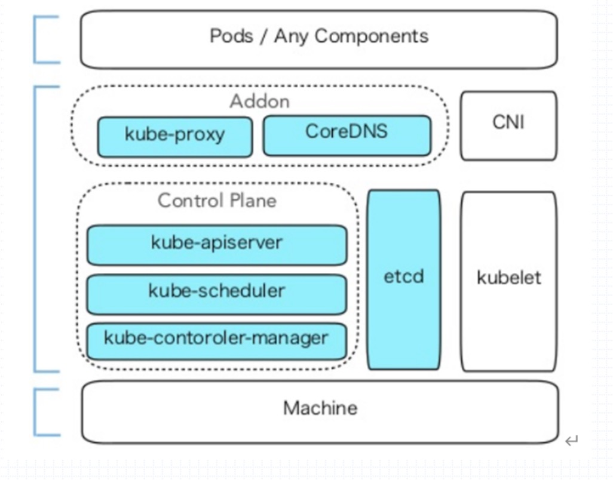
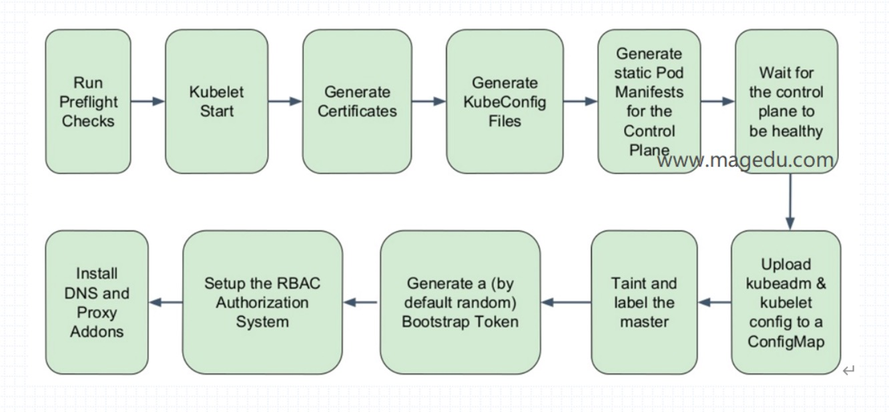

## 第一节 IT技术发展趋势(k8s背景)

### docker相关概念
- 镜像：
    1. 分层构建, aufs, overlayfs2
    1. 镜像格式: repo:tag
- 容器
- Docker Host(docker daemon)
- docker registry
    1. Docker Hub, 
    1. Quey
- container, image, network, volume,...
- docker-compose

### docker 网络模型
- none
- bridge
- host
- overlay(vxlan, valn), 叠加网络
- docker环境跨宿主机通信
    - 各宿主机SNAT -> DNAT
    - 叠加网络(覆盖网络)，隧道网络：但是因mtu的降低，效率降低
    - 三层网络：每个宿主机有强大路由表，利用注册中心存储其他容器的下一跳路由
    - 问题：频繁动态调整容器，需要强一致性的注册中心

### 容器编排工具
- k8s
    1. CNCF组织: 谷歌为推广k8s而成立的
    1. Istio: 服务网格
- swarm
- mesos(DC OS)+marathon

### k8s
operator: 复杂
controller: 简单的控制器

master node: 管理节点
- Api Server
- Controller Mannager
- Scheduler
- Etcd

worker node: 工作节点
- kubelet: 与master的ApiServer联系
- kube-proxy: 代理服务组件
- container engine: 容器引擎

## 第二节 安装k8s

## 第三节

### 分布式Kube Cluster
- API Server
    - 访问入口：https，6443
    - 存储：etcd(raft协议， k/v存储)
- Controller Manager: 代码化的运维
    Controller(control loop)
- Scheduler: 调度Pod

### Node
- kubelet: agent
- Docker
- kube-proxy

### Add-ons
- KubeDNS: CoreDNS
- Dashbord: Web UI
- 监控系统: prometheus
- 集群日志系统: EFK, LG

    EFK
    - ElasticSearch
    - Filebeat/Fluentd/fluent-bit/logstash(JRuby语言实现)
    - Kibana

    LG, 是云原生应用
    - Loki
    - Grafana

- Ingress Controller: 控制外部流量进入k8s集群

### ca认证和peer2peer通信

### k8s集群部署和运行模型
1. 二进制程序
1. pod, kubelet管理这些Pod
    - Static Pod
    - Pod
1. kaas: 云服务商提供的部署

### k8s的分层 
- Addon Operator: Cluster Api, Addons
- kubeadm: Kubernetes Api, Bootstrapping
- Cluster Api: Machines, Infrastructure

#### k8s的分层图

#### kubeadm部署的pod

### k8s容器间网络接口
- CNI: Container Network Interface
- k8s仅提供CNI，没有默认实现，具体实现有:
    - flannel(网络方案), Canal(网络策略)
    - Project Calico，网络+策略，
- CRI: Container Runtime Interface
- CSI: Container Storage Interface

#### k8s节点网络
- 节点网络
- Pod网络
- Service网络

kubeadm的执行流程
#### kubeadm的执行流程

