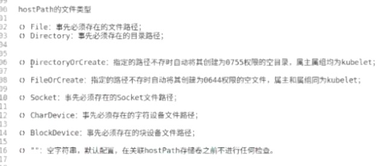
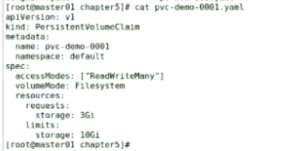
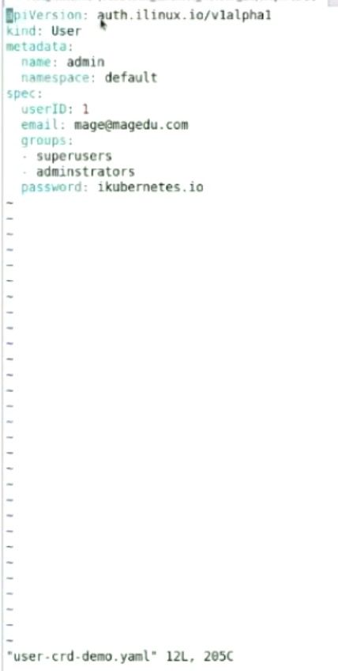

## 第一节 IT技术发展趋势(k8s背景)

### docker相关概念
- 镜像：
    1. 分层构建, aufs, overlayfs2
    1. 镜像格式: repo:tag
- 容器
- Docker Host(docker daemon)
- docker registry
    1. Docker Hub, 
    1. Quey
- container, image, network, volume,...
- docker-compose

### docker 网络模型
- none
- bridge
- host
- overlay(vxlan, valn), 叠加网络
- docker环境跨宿主机通信
    - 各宿主机SNAT -> DNAT
    - 叠加网络(覆盖网络)，隧道网络：但是因mtu的降低，效率降低
    - 三层网络：每个宿主机有强大路由表，利用注册中心存储其他容器的下一跳路由
    - 问题：频繁动态调整容器，需要强一致性的注册中心

### 容器编排工具
- k8s
    1. CNCF组织: 谷歌为推广k8s而成立的
    1. Istio: 服务网格
- swarm
- mesos(DC OS)+marathon

### k8s
operator: 复杂
controller: 简单的控制器

master node: 管理节点
- Api Server
- Controller Mannager
- Scheduler
- Etcd

worker node: 工作节点
- kubelet: 与master的ApiServer联系
- kube-proxy: 代理服务组件
- container engine: 容器引擎

## 第二节 安装k8s

### 声明式配置
### 运行应用
- Controller
- Service

### 部署
1. 要求
    - 所有节点时钟同步
        
            yum -y chrony
            systemctl start chrony
            systemctl enable chrony
    - 防火墙关闭

            systemctl stop firewalld
            systemctl disable firewalld
            systemctl restart docker （可能需要）
    - 禁用swap
        
            swapoff -a (临时关闭)
            vi /etc/fastab: # *swap, (永久关闭)
    - 所有节点id唯一
    - vi /etc/sysctl.d/k8s.conf
        
            sysctl -p /etc/sysctl.d/k8s.conf
            sysctl -a 
    
    查看命令:
    - lscpu
    - free -m
    - 

1. 各类节点所需部署的组件

        master
            apserver, controller-manager, scheduler, etcd
        worker
            kubelet, kube-proxy, docker
        每个节点都需要
            docker, kubelet, kubeadm, kubectl
        所需命令:
            docker version
        注意： mirrors.aliyun.com

1. 利用repo, 

        安装 kubelet kubeadm kubectl
        cat repo // 
        setenforce 0
        yum install kubelet kubeadm kubectl

1. 初始化控制平面，主节点 kubeadm init(50m时刻)

        配置各节点域名 vi /etc/hosts

        kubeadm init --help

        kubeadm init --image-repository registry.aliyuncs.com/google_containers --kubernetes-version $Version
        --control-plane-endpoint $MASTER (控制平面的地址)
        --apiserver-advertise-address $MASTER_IP (apiserver的地址)
        --pod-network-cidr 10.244.0.0/16 
        --token-ttl 0 (token不过期)

        查看需要的镜像命令：kubeadm config images list

        cgroupfs警告：vi /etc/docker/daemon.json 
1. 普通用户，

    cp /etc/kubernets/config ~/.kube/config, 目的顺利执行 kubectl
1. 安装flannel(cri)

    kubectl apply -f $github.com/flannel.yaml
1. 查看安装情况

    kubectl get nodes/cs
    kubectl get pods -n kube-system
1. 如果发生错误，需重新部署

    kubeadm reset
1. vi kubeadm-init: 保存join的token
1. 在node节点

    kubeadm join $master:6443 --token $token --discovery-token-ca-cert-hash $hash
1. 运行容器

        kubectl create deployment demoapp --image="ikubernetes/demoapp:v1.0" --dry-run=client
        docker加速器地址(82min):
            ustc
            163 
            azk
            cn
            qiniu
1. 扩展容器 

        kubectl scale deployment demoapp --replicas=3  
        kubectl delete pods $podName

## 第三节

### 分布式Kube Cluster
- API Server
    - 访问入口：https，6443
    - 存储：etcd(raft协议， k/v存储)
- Controller Manager: 代码化的运维
    Controller(control loop)
- Scheduler: 调度Pod

### Node
- kubelet: agent
- Docker
- kube-proxy

### Add-ons
- KubeDNS: CoreDNS
- Dashbord: Web UI
- 监控系统: prometheus
- 集群日志系统: EFK, LG

    EFK
    - ElasticSearch
    - Filebeat/Fluentd/fluent-bit/logstash(JRuby语言实现)
    - Kibana

    LG, 是云原生应用
    - Loki
    - Grafana

- Ingress Controller: 控制外部流量进入k8s集群

### ca认证和peer2peer通信


### k8s集群部署和运行模型
1. 二进制程序
1. pod, kubelet管理这些Pod
    - Static Pod
    - Pod
1. kaas: 云服务商提供的部署


### k8s的分层 
- Addon Operator: Cluster Api, Addons
- kubeadm: Kubernetes Api, Bootstrapping
- Cluster Api: Machines, Infrastructure

#### k8s的分层图


#### kubeadm部署的pod


### k8s容器间网络接口
- CNI: Container Network Interface
- k8s仅提供CNI，没有默认实现，具体实现有:
    - flannel(网络方案), Canal(网络策略)
    - Project Calico，网络+策略，
- CRI: Container Runtime Interface
- CSI: Container Storage Interface


#### k8s节点网络
- 节点网络
- Pod网络
- Service网络


kubeadm的执行流程
#### kubeadm的执行流程


### namespace资源


## 第四节(podAndResource)

### 容器关系
1. 亲密: 同Pod内 同进同出，共享一组存储卷、network、IPC、UTS
1. 非亲密:
    - Pod to Pod: 借助于的网络插件
    - Pod to Service: iptables, ipvs规则
        kube-proxy: 把集群上的每个service定义转换为本地的ipvs或者iptables规则
    - External Client -> Service or Pod

    Infrastructure container, 如Pause(暂停)，Pod相当于一主机()

### Deployment(Pod控制器基本介绍，40min)
1. template: Pod的定义

### apiServer的交互方式
1. 命令式命令: 命令，及选项来实现
1. 命令式配置文件: 命令，从配置文件中加载数据
1. 声明式配置文件: 声明式命令，从配置文件中加载数据

### 资源规范，配置清单
    ```
    apiVersion: ... # 资源对象所属的api群组及版本
    kind: ... # 资源类型
    metadata: # 资源对象的原数据
        ...
    spec: # 所需状态，或称为期望状态
        ...
    ```
kubectl explain $resource
kubectl api-resources

## 第五节(resource)

### 网络模型

1. 节点网络
1. Pod网路
1. 集群网路(服务网路)
各自独立的网段，相互间通信必须借助节点完成

网路模型上k8s内的四种常见通信
1. 同Pod内的容器间通信
1. Pod到Pod间通信
1. Pod到service的通信
1. 集群外部到service通信


ResfulAPI, https
资源类型，schema
    Pod, Deployment, Service
对象，object

### 资源规范

    apiVersion, Kind, metadata, spec, status
    控制器：负责确保将实际状态设定不断逼近或者等同于期望状态
    Control Loop
        create, delete, change

### 资源分类：
1. 工作负载型(workload), Pod
    - 无状态(stateless)：Deplyment, DaemonSet(系统级应用)
    - 有状态(stateful)：StatefulSet -> Operator(：StatefulSet之上的专用应用)
    - 任务：Job, Cronjob
1. 服务发现和负载均衡
    - Service 
    - Ingress
1. 配置和存储(CSI, volume)
    - ConfigMap/Secret
    - PVC/PV
    - Downward API
    - role, rolebinding
1. 集群级别资源
    - namespace
    - node 
    - clusterrole
1. 元数据类型
    LimitRange, ...

### 资源查看(30min)
    ```
    kubectl api-resources 
    kubectl explain configMap

    ```
    kubectl get --raw /apis/GROUP/VERSION/namespaces/NAMESPACE/podes/POD

    apiServer就是一个http服务器

    kubectl get pods/$pod_name -o yaml

### 资源引用格式
    <type>/<name>: pods/mypod, deployment/demoapp
    <type> <name>: pods mypod, deployment demoapp

### 常用命令
1. kubectl get pods
1. kubectl apply -f ***.yaml
1. kubectl delete pods/pods_name    
1. kubectl logs $pods_name    
1. kubectl describe pods/$pods_name    
1. kubectl exec $pods_name -c $container_name -- cmd
1. kubectl edit  (实时编辑、修改，但资源的某些字段不运行实时修改)
1. kubectl apply -f RS.yaml: 新增+修改+删除

### namespace(集群级别资源)
1. kubectl get namespaces
1. kubectl get all
1. 在yaml中的资源分割符: --- (独占单行)


## 第六节(nodeAndPod) 

### json格式化(2min)
yum install epel-release
yum instal jq

### node资源(4min)
1. 查看node资源
    ```
    kubeclt get nodes
    kubeclt get nodes/$node_name -o wide
    ```
    
1. node-controller, 健康检查
    1.1.3之前: kubelet每10s给Apiserver发送一次node健康状态;连续4个周期未收到node状态，标识其为notReady。但每次带上images的信息比较大，浪费网络资源

    1.1.3之后: 节点租约，每10s在status发送变化或者超过5分钟后，上报一次到apiServer
    kubectl get leases -n kube-node-lease

    k8s上每个资源都有对应资源控制器，但资源控制器可能管理多种资源

### pod资源(28min)
#### 定义

    共享IPC UTS Network等名称空间的一组容器
    基础pod: pause的主要作用， user/mount

#### pod的常用相位: 
1. Running, 
1. Pending(未调度成功, 仍处于下载中), 
1. Succeeded(成功终止，如job资源)
1. Failed
1. Unkown: kubelet无法通信

#### Pod容器的常见状态：
1. CrashLoopBackOff, 
1. Error: pod中容器的状态

#### Pod中的多个容器(39min)
1. Sidercar: 为主容器提供辅助功能的，如：日志采集功能
1. Adapater: 使主容器其兼容k8s原生功能
1. Ambassador(大使): 方便主容器主动对外联络

    hook(钩子): post start, pre stop
    probe(探针): startup, liveness, readiness

#### 查看容器信息   
    kubectl describe pods/$POD_NAME

### Pod中的环境变量: 通过环境变量向容器传递信息

    env(容器内变量)
    云原生是支持环境变量的，非云原生不支持
    ```
    spec:
        containers:
        - name: demoapp
            image: ikubernetes/demoapp:v1.0
            env:
            - name: HOST
            value: "127.0.0.1"
            - name: PORT
            value: "8080"
    ```
    
#### Pod暴露端口，通过hostPort暴露容器服务
```
kind: Pod
metadata:
  name: mypod-with-ports
  labels:
    app: mypod
    release: canary
spec:
  containers:
  - name: demoapp
    image: ikubernetes/demoapp:v1.0
  - ports:
    - containerPort: 80
      name: http
      protocol: TCP
      hostPort: 10080
```

### pod级别的hostNetwork，共享宿主机的网络名称空间，但是很不安全(65min)
```
kind: Pod
metadata:
  name: mypod-with-ports
  labels:
    app: mypod
    release: canary
spec:
  containers:
  - name: demoapp
    image: ikubernetes/demoapp:v1.0
  - ports:
    - containerPort: 80
      name: http
      protocol: TCP
  hostNetwork: true
```

作业: wordpress, mysql


***
## 第七节(securityContext) 

### 容器运行时CRI的实现
- podman
- docker

[PodStruct](../ref/img/07PodStruct.jpg)

### 资源规范格式(15min)

```
// kubectl explain (查看字段含义)
apiVersion: Group/Version
kind: 
metadata:
    name: ...
    namespace: ...
spec:
```
apiVersion规范 // kubectl api-versions: 查看所有版本
    - alpha(内测版): vialpha1, v1alpha2
    - beta: v1beata1
    - v1

### 容器的安全上下文，Security Context(25min)
pod的隔离集群
1. 定义：一组用于决定容器如何创建和运行的约定条件，他们代表创建和运行容器时使用的运行时参数
1. Pod上SC有两个级别
    - Pod级别：对pod中的所有容器生效
    - 容器级别：只对当个容器生效
    - PSP级别：PodSecurityPolicy

```
apiVersion: v1
kind: Pod
metadata: {}
spec: 
  securityContext: # Pod级别的安全上下文，对内部所有容器生效
    runAsUser <integer> # 以指定用户身份运行容器，默认由镜像中的USER指定
    runAsGroup <integer> # 以指定用户组运行容器，默认使用的组随容器运行时
    supplementalGroups <[]integer> # 为容器中1号进程的用户添加的附加组
    fsGroup <integer> # 为容器中1号进程附加的一个专用组，其功能类似sgid
    runAsNonRoot <boolean> # 是否以非root身份运行
    seLinuxOptions <object> # SELinux的相关配置
    sysctls <[]object> # 应用到当前Pod上的名称空间级别的sysctl参数设置列表
    windowsOptions <object> # windows容器专用的设置
  containers:
  - name: ..
    image: ..
    securityContext: # 容器级别的安全上下文，对当前容器生效
      runAsUser <integer> # 以指定用户身份运行容器，默认由镜像中的USER指定
      runAsGroup <integer> # 以指定用户组运行容器，默认使用的组随容器运行时
      runAsNonRoot <boolean> # 是否以非root身份运行
      allowPrivilegeEscalation <boolean> # 是否允许特权升级
      capabilities <object> # 于当前容器上添加（add）或删除（drop）的内核能力
        add <[]string> # 添加由列表定义的各内核能力
        drop <[]string> # 移除由列表定义的各内核能力
      privileged <boolean> # 是否运行为特权容器
      procMount <string> # 设置容器的procMount类型，默认为DefaultProcMount;
      readOnlyRootFilesystem <boolean> # 是否将根文件系统设置为只读模式
      seLinuxOptions <object> # SELinux的相关配置
      sysctls <[]object> # 应用到当前Pod上的名称空间级别的sysctl参数设置列表
      windowsOptions <object> # windows容器专用的设置
```

常见的capabilities：
- CAP_CHOWN: 改变uid和gid
- CAP_MKNOD: 创建设备文件
- CAP_NET_ADMIN: 网络管理权限
- CAP_SYS_ADMIN: 大部分管理权限
- CAP_SYS_TIME: 修改系统时间
- CAP_SYS_MODULE: 装卸载内核模块
- CAP_NET_BIND_SERVER: 是否允许普通用户绑定1024内端口

imagePullPolicy(镜像拉取策略)
    Never: 从不拉取
    IfNotPresent: 不存在才去拉取；非latest标签的默认值
    Always: 总是拉取；latest标签的默认值

setcap / getcap：命令直接设定权限

command: 自定义image要运行的程序
args: 向自定义的command传递参数

kube-proxy功能: 是将apiServer中的service变动，同步到对应节点的iptables和ipvs变动

Pod内可设定的安全参数：
- kernel.shm_rmid_forced, 
- net.ipv4.ip_local_port_range, 
- net.ipv4.tcp_syncookies
修改如： /etc/default/kubelet
KUBELET_EXTRA_ARGS='--allowed-unsafe-systcls=net.core.somaxconn,net.ipv4.ip_unprivileged_port_start'


***

## 第八节(probeAndHook)


 
### Cloud Native中的服务所需的基础功能
1. process health: 进程健康
1. metrics: 指标
1. readiness: 准备
1. liveiness: 存活
1. tracing: 追踪
1. logs: 日志 

### 容器探针（10min）

```
# Pod的yaml
spec:
  containers:
  - name: ...
    image: ...
    livenessProbe:
      exec <object>                 # 命令式类型探针
      httpGet <object>              # http GET类型探针
      tcpSocket <object>            # tcp Socket类型探针
      initialDelaySeconds <integer> # 发起初次探测请求的延后时长
      periodSeconds <integer>       # 请求周期
      timeoutSeconds <integer>      # 超时时长
      successThreshold <integer>    # 成功阈值
      failureThreshold <integer>    # 失败阈值
```

三种探针场景：
1. LivenessProbe: 周期性检测，检测未通过，kubelet会根据restartPolicy的定义决定是否重启该容器; 未定义时，kubelet认为容器未终止，即为健康

1. ReadinessProbe: 周期性检测，检测未通过，与Pod关联的Service，会将此Pod从service的后端可用列表删除; 直到再次就绪，重新添加回来；未定义时，只要容器未终止，即为就绪；

1. StartupProbe: 便于用户使用同LivenessProbe的不同参数或阀指；

三种探针方式：
1. ExecAction：直接执行命令，命令成功返回即成功
1. TCPSocketAction：端口能正常打开，即成功
1. HTTPGetAction：向指定path发送http请求，2xx 3xx响应表示成功

### 容器生命周期的钩子(48min)


```
spec:
  containers:
  - name: demo
    image: ikubernetes/demoapp:v1.0
    imagePullPolicy: IfNotPresent
    securityContext:
      capabilities:
        add:
        - NET_ADMIN
    livenessProbe:
      httpGet:
        path: '/livez'
        port: 80
        scheme: HTTP
      initialDelaySeconds: 5
    lifecycle:
      postStart:
        exec:
          command: ['/bin/sh', '-c', 'iptables -t nat -A PREROUTING -p tcp --dport 8080 -j REDIRECT --to-ports 80']
      preStop:
        exec:
          command: ['/bin/sh', '-c', 'while killall python3; do sleep 1; done']
```

### Pod中的多容器（55min）
1. Sidecar: 为主容器提供辅助功能(外部进入容器)，如代理等
1. Adapter: 使主容器能适配外部环境, 如nginx的日志输出适配于promehteus
1. Ambassador: 使主容器更好的接入外面多变环境(容器内部输出于外部)
1. initContainers: 
    - 先启动成功后，再启动主容器
    - 初始化容器执行完，即退出

```
// initContainer
spec: 
  initContainers:
  - name: iptables-init
    image: ikubernetes/admin-box:lastest
    imagePullPolicy: IfNotPresent
    command: ['/bin/sh', '-c']
    args: ['iptables -t nat -A PREROUTING -p tcp --dport 8080 -j REDIRECT --to-ports 80']
    securityContext:
      capabilities:
        add:
        - NET_ADMIN
  containers:
  - name: demo
    image: ikubernetes/demoapp:v1.0
    imagePullPolicy: IfNotPresent
    ports:
    - name: http
      containerPort: 80

// sidecar
spec: 
  containers:
  - name: proxy
    image: envoyproxy/envoy-alpine:v1.14.1
    command: ['/bin/bash', '-c']
    args: ['sleep 5 && envoy -c /etc/envoy/envoy.yaml']
    lifecycle:
      postStart:
        exec:
          command: ['/bin/sh', '-c', 'wget -O /etc/envoy/envoy.yaml http://ilinux.io/envoy.yaml']
  - name: demo
    image: ikubernetes/demoapp:v1.0
    imagePullPolicy: IfNotPresent
    env:
      name: HOST
      value: "127.0.0.1"
      name: PORT
      value: "8080"
```


## 第九节(computeResource)
### k8s计算资源规范 compute resource, reqeust, limit

1. request（下阈值）: 确保节点至少为Pod或者容器配备的资源最小量
1. limit（上阈值）: 确保节点至少为Pod或者容器配备的资源最大量
1. k8s计算资源主要指：
    - CPU，可压缩型；CPU单位：多个CPU核心，1核=1000m核
    - Memory，不可压缩型；单位：1Ki, 1Mi, 1Gi
    - Volume，

```
spec: 
  containers:
  - name: demo
    image: ikubernetes/stress-ng:v1.0
    imagePullPolicy: IfNotPresent
    command: ['/usr/bin/stress-ng', '-c', '']
    resources:
      requests:
        cpu: '200m'
        memory: '128Mi'
      limits:
        cpu: '500m'
        memory: '512Mi'
```

### Pod的服务质量(QoS Class)，代表Pod的资源被优先满足的类别（45min）
1. Guaranteed: 必须，Pod内的每个容器分别限制计算资源，且上下阈值相同
1. Bustable: 中间，
1. BestEffort: 尽力，未对任何容器设定任何需求或限制

***

## 第10节(serviceBase)


### 定义
    Service：标准的资源类型，Service Controller
        为动态的一组Pod提供一个固定的访问入口，ClusterIP(Cluster Network)
    Endpoint(IP:PORT)：标准资源类型，Endpoint controller, 通过标签选择器监控和管理pod和service的映射; Service借助其实现其功能

    kube-proxy, Service Controller位于各节点上agent：

### service代理模型：kube-proxy如何确保service能正常工作
1. userspace模型：Pod -> Service, iptables拦截规则，但不调度，将流量转给kube-proxy(此时类型nignx的反响代理)
1. iptables模式，一个service会生成大量的规则
1. ipvs模式


### Service类型：
1. ClusterIP：通过集群内部IP地址暴露服务，但是该地址仅在集群内部可达，无法被集群外客户端访问；默认类型
1. NodePort：是ClusterIP的增强类型，在ClusterIP的功能之上，在每个节点上使用一相同端口号，将外部流量引入该service
1. LoadBalancer：是NodePort的增强型，要借助于底层IaaS云服务的LBaaS按需管理LB
1. ExternalName：借助集群上的kubeDNS实现，服务的名称会被解析为一个CNAME记录，而CNAME名称会被DNS解析为集群外部的服务的IP地址；没有ClusterIP和NodePort


## 第11节(service)

```
    kind: Service
    metadata:
        name: -
        namespace: -
    spec:
        type<string> # 默认ClusterIP
        selector <map[string]stirng> # 等值
        ports:
        -   name: 
            protocol:
            port:
            targetPort:
            nodePort:
```

### labelSelect, label

### 管理集群外部的服务(71min)
1. 认为创建Endpoint，关联外部服务
1. 认为创建Service，关联对应Endpoint


***
## 第12节(kubeProxyAndDns)

### iptables代理模式下的ClusterIP，每个service在每个节点上，都会生成相应的iptables规则
1. KUBE-SERVICES: 包含所有ClusterIP类型的Service的流量匹配规则，有PREROUTING和OUTPUT两个内置链直接调用；每个Service对象包含两条规则定义，对于所有发往该Service(目标ip为Service_IP且目标端口为Service_Port)的请求报文，前一条用于为那些非源自Pod网络(! -s 10.244.0.0/16)中请求报文借助于KUBE-MARQ-MASK自定义链中的规则打上特有的防火墙标记，后一条负责将所有报文转至专用的以KUBE-SVC为名称前缀的自定义链，后缀是Service信息的hash值

1. KUBE-NODEPORTS

1. KUBE-MARK-MASQ: 专用目的自定义链，所有转至该自定义链的报文都将被置入特有的防火墙标记(0x4000)，以便于将特定的类型的报文定义为单独的分类，目的在将该类报文转发到目标端点之前，由POSTROUTING规则链进行源地址转换

1. KUBE-SVC-<HASH>: 定义一个服务的流量调度规则，它通过随机调度算法(random)将请求发送给该Service的所有后端端点，每个后端端点定义在以KUBE-SEP为前缀名称的自定义链上，后缀是端点信息的hash值

1. KUBE-SEP-<HASH>: 定义一个端点相关的流量处理规则，它通常包含两条规则，前一条用于为那些源自该端点自身(-s ep_ip)的请求流量调用自定义链KUBE-MARQ-MASK打上特有防火墙标记，后一条负责将发往该端点的所有流量进行目标IP地址和端口转换，新目标为该端点的IP和端口(-j DNAT --to-destination ep_ip:ep_port)

1. KUBE-POSTROUTING: 专用的自定义链，有内置链POSTROUTING无条件调用，负责将拥有特有防火墙标记0x4000的请求报文进行源地址转换(target为实现地址伪装的MASQUERADE)，新的源地址为报文离开协议栈时流经接口的主IP(primary ip)地址


### ipvs代理模式(10min)
kube-proxy会在每个节点上创建名为kube-ipvs0的虚拟接口，并将集群所有service对象的ClusterIP和ExternalIP都配置在该接口；kube-proxy为每个service生成一个虚拟服务器(virtual server)的定义
1. nat, 仅需要借助少量iptables规则，完成源地址转换等功能
1. 修改集群为ipvs模式

### service的注册和发现：
1. zk, Euraka, Consul...
1. 将传统DNS服务直接提供一个云原生解决方案，他支持从apiServer动态加载相关的service及端点信息，并自动生成资源记录
1. 服务注册和发现的总线: kubeDNS
    - SkyDNS
    - KubeDNS
    - CoreDNS

docker的服务发现
1. 基于环境变量
1. 基于dns


## 第13节(headlessService)

headless service: 无头服务
stateful: 每个个体具有一定程度的独特性，由其存储的状态决定； 
stateless

## 第14节(volume)
docker的文件系统，与docker容器有同样的生命周期
外部存储空间：
    Host
    network storage

存储卷类型:
1. Host级别: hostPath, Local
1. 网路级别: nfs, GlusterFS, rbd(块设备), CephFS(文件系统)...
1. 临时存储: emptyDir

### Pod使用volume步骤
1. Pod上定义存储卷，并关联至目标存储服务上
1. 在需要存储卷的容器上，挂着其pod的存储卷

```
spec:
  volumes:
  - name: <str> # 存储卷名称标识，仅可使用DNS标签格式的字符，在当前pod中必须唯一
    VOL_TYPE: <obj> # 存储卷插件及具体的目标存储供给方的相关配置
  containers:
  - name:
    image:
    volumeMounts:
    - name: <str> # 要挂载的存储卷的名称，必须匹配存储卷列表中某项的定义
      mountPath: <str> # 容器文件系统上的挂载点路径
      readOnly: <bool> # 是否挂载为只读，默认“否”
      subPath: <str> # 挂载存储卷上的一个子目录值指定的挂载点
      subPathExpr: <str> # 挂载由指定的模式匹配到的存储卷的文件或目录至挂载点
```

### 存储卷插件(volume plugin)

In-Tree: kubelet原生支持的(内建的存储插件)
Out-Tree: CSI、FlexVolume

1. Host级别: hostPath, Local
1. 网络级别: nfs, GlusterFS, rbd(块设备), CephFS(文件系统)...
1. 临时存储: emptyDir
1. CSI(container storage interface), 如 Longhorn

### pv/pvc(32m)


### emptydir(临时的)


### hostpath(节点级)


hostpath的文件类型


### nfs(网络级)(63m)


### pv的创建方式
1. 管理员事先创建
1. 借助storageclass动态创建

### pv/pvc 职能(需求和实现)分离


### pv/pvc/storageclass的使用过程


### pv/pvc
把存储的创建和消费分开

storageClass: pv的创建模版，按用户的需求创建pv
1. pvc: persistent volume claim, 持久卷申请; k8s上标准的资源类型之一；由apiserver用户使用
1. pv: persistent volume, 持久卷，可被pvc绑定；而pv一定要关联与某个真正的存储空间(一般是网路存储服务上的存储空间)，由集群管理员管理
1. pvc创建后，需找到最为匹配的pv，并与之绑定
  在哪里找：
  二者要么都不属于任何storageclass资源，要么属于同一个storageclass资源

  怎么找：
  

Pod使用这类存储的步骤：
1. admin: 创建好pv
1. user: 按需创建pvc，而后创建Pod，在pod调用pvc类型的存储插件，调用同一个名称空间的pvc资源

### pv/pvc的yaml





## 第15节(29min)

### k8s和docker的关系


### 概念
1. 存储卷：隶属于Pod，而非容器；pause容器支持
    kubelet为了支持存储卷，内建来很多存储服务的客户端：emptydir、hostPath、NFS

### StorageClass: 模版 (43min)
1. pv和pvc都可能属于某个特定的sc
1. 模拟名称空间: 
1. 创建pv的模版: 将某个存储服务与sc关联起来

### kube-controller-manager 兼容ceph (56min)

### storageclass-demo.yaml


### storageclass的参数


### Longhorn(Rancher)


#### 部署时注意事项
1. kubeadm token create --print-join-command
1. 每个节点上部署iscsi的适配器，centos7上的程序为iscsi-initiator-utils

15volumes-pvc-longhorn-demo


### 存储卷总结
1. emptydir
1. hostPath
1. NFS
1. Longhorn(借助CSI)


***
## 第16节(configMap)
核心资源类型存储卷，PV, PVC, SC, CSI(Longhorn)
kubelet In-Tree
  插件: configMap, Secret, downwardAPI

如何为容器化应用提供配置信息：
1. 启动容器时，直接向应用程序传递参数，args: []
1. 将定义好的配置文件焙进镜像中
1. 通过环境变量向容器传递配置数据：前提是，应用支持从环境变量加载配置信息，制作镜像时，用entrypoint处理预变量，将环境变量替换到应用的配置文件中
1. 基于存储卷向容器传递配置文件：运行中的改变，需要应用程序重载

ConfigMap，以k/v格式保存配置项的名称和配置数据，
1. 由Pod中的容器以环境变量的方式从configMap中加载特定的值
1. 可让Pod直接将configMap以存储卷的形式附加，而由容器挂载到指定目录下，从而获取到完整的配置文件

### 创建方式
1. 命令式命令: kubectl create configmap demoapp-config --from-literal=host=0.0.0.0 --from-literal=port=8080
1. 命令行(文件): kubectl create configmap nginx-confs --from-file=./myserver.conf --from-file=status.cfg=./myserver-status.cfg
1. 命令行(目录): kubectl create configmap nginx-config-files --from-file=./nginx.conf.d/
1. 资源清单: 

### 使用configmap 


1. 基于键值的方式引用
  `` `
  spec:
  containers:
  - image: ikubernetes/demoapp:v1.0
    name: demoapp
    env:
    - name: PORT
      valueFrom:
        configMapKeyRef:
          name: demoapp-config
          key: demoapp.port
          optional: false
  ```
1. 基于存储卷的方式引用
  ```
  spec:
  containers:
  - image: nginx:alpine
    name: nginx-server
    volumeMounts:
    - name: ngxconfs
      mountPath: /etc/nginx/conf.d/
      readOnly: true
    volumes:
    - name: ngxconfs
      configMap:
        name: nginx-config-files
        optional: false
  ```
  kubectl get pods/configmaps-env-demo -o go-template={{.status.podIP}}

### 修改configMap中的内容
    
    kubectl edit cm $cm_name: edit命令是立即生效的
    configMap类似配置中心的服务
    nginx -s reload
    nginx -T


***

## 第17节(secretDownwardAPI)
kubectl create secret --help
### secret类型
1. docker-registry: 创建一个给 Docker registry 使用的 secret
1. tls: 专门用于保存tls/ssl用于证书和配对的密钥
1. generic: 其他的类型
  - --type="kubernetes.io/basic-auth"
  - --type="kubernetes.io/rbd"
  - --type="kubernetes.io/ssh-auth"
  - kubeadm的bootstrap所使用的token
1. eg: kubectl create secret generic web-basic --from-literal=username=root  --from-literal=password=root --type="kubernetes.io/basic-auth"

1. 另外，保存专用于ServiceAccount相关的token信息的secret资源，会使用资源注解来保存其使用场景，其注解：
  annotations:
    kubernetes.io/service-account.name: node-controller
    kubernetes.io/service-account.uid: $uuid
1. 还有一种有kubeadm的bootstrap所使用的token专用类型，他通常保存于kube-system名称空间，以bootstap-token为前缀
  --type="bootstrap.kubernetes.io/token"

### annotations
1. annotation的名称遵循类似于labels的名称格式，但其数据长度不受限制，但lables的数据长度只有63个字符
1. 不能用于被标签选择器作为筛选条件；但常用于为处于beta阶段的app提供临时的配置接口
1. 专用的管理命令: kubectl annotate $type/$ name key=val; 删除注解 kubectl annotate $type/$ name key-

### tls(31m)
是一种独特的类型，在创建secret的命令中，除了类型标识不同外，他还需要使用专用的选项，--cert=$证书文件路径  和 --key=$私钥文件路径

无论证书和私钥文件名是什么，他们统一存储为tls.key和 tls.crt

1. 生成密钥: (umask 077; openssl genrsa -out nginx.key 2048)
1. 生成证书: openssl req -new -x509 -key nginx.key -out nginx.crt -subj /C=CN/ST=BJ/L=BJ/O=ORG/CN=tree.com
1. kubectl create secret tls nginx-ssl --key=./nginx.key --cert=./nginx.crt
1. kubectl describe secret nginx-ssl
    kubectl get secret nginx-ssl -o yaml
    echo $tls.key | base64 -d

### docker-registry(39m)
```
kubectl create secret docker-registry my-secret --docker-server=DOCKER_REGISTRY_SERVER --docker-username=DOCKER_USER --docker-password=DOCKER_PASSWORD --docker-email=DOCKER_EMAIL
```
1. 命令行生成
1. 也可以从docker的认证文件中加载信息，这时用 --from-file 选项：$HOME/.dockercfg, ~/.docker/config.json
1. 如何使用: pod.spec.imagePullSecrets

### secret的使用
1. pod的env(环境变量)的传值方式, 仅pod启动是读取一次env变量
  ```
  env:
  - name:
    valueFrom:
      secretKeyRef:
        name: mysql-root-auth
        key: password
  ```
1. volume(存储卷)的格式
  ```

  ```


### downwardAPI存储卷类型，


容器运行时，获取容器定义时的信息。严格意义上不是存储卷，原因在于，它引用的是Pod自身的运行环境信息，这些信息在Pod启动时就存在
1. fieldRef: 
    fieldPath: $pod定义时的不变属性(如: metadata.name)
1. resourceFieldRef: 
    resource: $pod运行时计算的属性(如: limits.cpu)
    divisor: 1Mi


***
## 第18节(ReplicaSet)
k8s以应用(Pod)为中心
应用编排
  部署、扩展、更新、回滚

### 负责应用编排的控制器有如下几种
1. ReplicationController: 早期的Pod控制器(已废弃)
1. ReplicaSet: 副本集, 负责管理一个应用的多个副本
1. Deployment: 部署(高级控制器)，不直接管理Pod，借助于ReplicaSet来管理Pod
1. DaemonSet: 守护进程集, 用于确保在每个节点上仅运行某个应用的一个Pod副本
1. StatefulSet: 功能类似Deployment，但专用于编排有状态应用
1. Job：有终止期限的作业式任务，而非一直处于运行状态的服务进程
1. CronJob：有终止期限的周期性作业任务

### 定义要素
1. 标签选择器
1. 期望的副本数
1. Pod模版
```
  kind: ReplicaSet
  spec:
    minReadySeconds <int> #
    replicas <int> #
    selector:
      matchExpressions <[]Object>
      matchLabels: <map[string][string]>
        app: demoapp
    template:
      metadata:
        labels:
          app: demoapp
      spec:
        containers:
```

### ReplicaSet的更新机制(手动删除式更新)
1. 单批次删除所有Pod，一次完成所有更新，服务会中断一段时间
1. 灰度(滚动)更新: 分批次更新
1. set image: 更新应用版本，但对replicaSet来说，仅能更新APIServer中的定义


***
## 第19节(blueGreenAndRoll)


***
## 第20节(Deployment&DaemonSet&Job&CronJob)
### Deployment
```
apiVersion: apps/v1
kind: Deployment
spec:
  minReadySeconds <int>
  replicas <int>
  selector <obj>
  tmeplate <obj> # Pod定义
  revisionHistoryLimit <int>
  strategy #更新策略
    type
    rollingUpdate
      maxSurge
      maxUnavailable
  progressDeadlineSeconds <int>
  paused
```
kubectl rollout --help # 滚动命令

### DaemonSet
```
apiVersion: apps/v1
kind: DaemonSet
spec:
  minReadySeconds <int>
  selector <obj>
  tmeplate <obj> # Pod定义
  revisionHistoryLimit <int>
  updateStrategy #更新策略
    type
    rollingUpdate
      maxUnavailable
```

### Job(69min)
```
apiVersion: batch/v1
kind: Job
spec:
  selector <obj>
  tmeplate <obj> # Pod定义
  completions <int>
  ttlSecondsAfterFinished <int>
  parallelism <int>
  backoffLimit <int>
  activeDeadlineSeconds <int>
```

### CronJob(80min)
```
apiVersion: batch/v1beta1
kind: CronJob
spec:
  jobTemplate <obj> # job作业模版
    metadata <obj>
    spec <obj>
  schedule <str>
  concurrencyPolicy <str> # 并发策略，Allow, Forbid, Replace
  failedJobsHistoryLimit <int>
  successfulJobsHistoryLimit <int>
  startingDeadLineSeconds <int>
  suspend <boolean>
```

***
## 第21节(StatefulSet)
### StatefulSet(20m)
通用的有状态应用控制器

1. 每个Pod都有自己的唯一标识，故障时，它只能被拥有同一标识的新实例所取代；
    - ¥{STATEFULSET_NAME}-${ORDINAL}: web-0, web-1, web-2
    - Headless Service
1. 若有必要，可为每个Pod配置专用的volume，其只能时PVC格式；

### awesome operator(有状态应用的集群管理器 35m)

### StatefulSet 格式
```
spec:
  replicas 
  selector
  template
  serviceName
  volumeClainTemplates
    apiVersion
    kind
    meatdata
    spec
  podMangementPolicy <str> # Pod管理策略，默认的"OrderedReady"表示顺利创建并逆序删除，另一可用值"Parallel"表示并行模式
```

### longhorn(50m)


***
## 第22节(auth)
系统访问控制:
插件化实现三个功能
1. 认证(Authn)，
1. 授权(Authz)，
1. 准入控制(Admission)

认证：
  用户：
    user account: 人类用户，k8s不负责这类数据，需借助外部组件实现
    service account: 由k8s上运行的pod访问apiServer时使用，隶属于某个名称空间
  用户组

### Authn, 认证 通行证

- **用户**
  - User Account
  - Service Account

- **用户组**
  - system:unauthenticated, 未通过认证用户
  - system:authenticated, 通过认证的用户
  - system:serviceaccounts, 所有名称空间的ServiceAccount对象
  - system:serviceaccounts:<namespace>

- **认证方式**
  1. X509数字证书认证
    
    证书中的Subject中
    CommonName, CN: 用户名
    Orgnization, O: 组名

  1. 引导令牌(Token): 在节点加入集群时临时认证

  1. 静态令牌: 存储于apiServer进程可直接加载的文件中的令牌，该文件内容会由apiServer缓存于内存中

  1. 静态密码: 存储于apiServer进程可直接加载的文件中的账号密码，该文件内容会由apiServer缓存于内存中

  1. ServiceAccount令牌: 用于认证ServiceAccount

  1. OpenID Connect令牌(OIDC): OAuth2

  1. Webhook令牌

  1. 代理认证

### Authz, 授权 权限管理和分配

**授权方式**:
  1. Node: 专用于控制kubelet
  1. ABAC: Attribution, 基于属性的访问控制
  1. RBAC: RoleBased AC, 基于角色的访问
  1. Webhook: http的回调


### Admission, 准入控制。

检测资源是否合规，准入控制操作，只作用于用户的“写请求”

**准入控制器**
  1. LimitRanger: 每个pod的个体限制
  1. ResourceQuota: 整体的限制
  1. PSP: PodSecurityPolicy 在集群级别限制用户能使用那些特权


### 认证的实现(46m)

**ServiceAccount令牌认证**, K8S自动为每个Pod注入一个ServiceAccount, 令牌在每个名称空间中，会自动(由ServiceAccount准入控制器负责)存在一个ServiceAccount，将被该空间下每个pod共享使用


**kubeconfig配置文件**(65m)


1. /etc/kubernetes: kubectl options/ kubectl config
1. 可管理多集群的多个用户


***
## 第23节(authz)
### 单向https认证(24m) 
1. 验证cn名称
1. 验证ca来源合法
1. 验证ca有效期

### 自签证书(40m)

### 授权(65m)
DAC, MAC, RBAC, ABAC

RBAC: Role-Based
1. 四个资源类型：
  Role: 名称空间内的角色
  ClusterRole: 集群级别的角色
  RoleBinding: 角色绑定；用户仅得到特定名称空间下的Role权限
  ClusterRoleBinding: 集群角色绑定

  user -> RoleBinding -> ClusterRole，权限降级: 用户得到的权限仅是ClusterRole的权限在Rolebingding所属的名称空间上的一个子集

  kubectl get role kube-proxy -n kube-system -o yaml

1. 能接受verb的目录有三类:
  - resources: 资源类型，该类型下的所有对象都是目标，pods
  - resourceNames: 特定的对象个体，pods/mypod
  - nonresourcesurl: 非资源型的URL，/status
1. Verbs:
  create, get, list, update, delete, patch


***
## 第24节(auths)

### role


### rolebinding


### kubernetes-dashboard, vmware
1. kubectl apply -f https://raw.githubusercontent.com/kubernetes/dashboard/v2.2.0/aio/deploy/recommended.yaml


### serviceAccout to config
1. kubectl config set-credentials k8s-admin --token=$token --kubeconfig=/tmp/k8s-admin.conf
1. kubectl config view --kubeconfig=/tmp/k8s-admin.conf
1. bash gen-kubeconfig-based-sa.sh $sa $namespace $clusterContext


### 准入控制(65m): 校验和变异(即附加默认值)
1. limitranger: 为Pod添加默认的计算、存储资源需求和资源限制；支持分别在容器和Pod级别进行限制
1. resourcequota: 限制资源数量，限制计算、存储资源总量
1. podsecuritypolicy: 在集群级别，限制用户在Pod上可配置使用的securityContext

### limitranger


### resourcequota(90m)


### psp: podsecuritypolicy


注意：psp必须先创建，再启动配置psp的apiServer  


***
## 第25节(flannel)


***
## 第26节(Calico)


***
## 第27节(Calico)


***
## 第28节(networkPolicy)

### 网络策略：管控pod间的通信流量(13m)

  k8s的名称空间，仅用于为资源名称提供隔离机制


***
## 第29节(scheduler)


***
## 第30节(scheduler)

### 污点容忍度(46m)

***
## 第31节(CRD)





更复杂的CRD控制器，称为Operator

***
## 第32节(Ingress)
### 外部流量进入集群内部的实现
1. Service:
  NodePort
  externalIp
1. host:
  hostPort
  hostNetwork
1. Ingress: 集群外部注入集群内部的流量
  Egress: 集群内部流出到集群外部的流量

### Ingress 和 Ingress Controller
Ingress: 是一个标准的资源
Ingress Controller: Ingress控制器
  http/https代理服务
    Ingress-Nginx: Kong
    HAProxy
    Envoy: Contour, Gloo
    Traefik

### Ingress规范(34m)
```
 v1beta1 Ingress 资源规范

apiVersion: extensions/v1beta1 # 资源所属的api群组和版本
kind: Ingress # 资源类型标识符
metadata: # 元数据
  name: <str> # 资源名称
  annotations: # 资源注解: v1beta1使用下面的注解来指定要解析的控制器类型
    kubernetes.io/ingress.class: <str> # 适配的Ingress控制器类别
  namespace: <str> # 名称空间
spec:
  rules: <[]obj> # Ingress规则列表
  - host: <str> # 虚拟主机的FQDN，支持"*"前缀通配符，不支持IP，不支持指定端口
    http: <obj>
      paths: <[]obj> # 虚拟主机PATH定义的列表，有path和backend组成
      - path: <str> # 流量匹配的http path，必须以/开头
        pathType: <str> # 匹配机制，支持 Exact, Prefix, ImplementationSpecific
        backend: <obj> # 匹配到的流量转发到的目标后端
          resource: <obj> # 引用的同一名称空间下的资源，与下面两个字段互斥
          serviceName: <str> # 引用的service资源的名称
          servicePort: <str> # service用于提供资源的端口
  tls: <[]obj> # TLS配置，用于指定rules中定义的哪些host需要https模式
  - hosts: <[]str> # 使用同一组证书的主机名称列表
    secretName: <str> # 保存与数字证书和私钥信息的secret资源名称
  backend: <obj> # 默认backend定义，可嵌套字段集使用格式跟rules字段中的相同
  ingressClassName <str> # ingress类名称，用于指定适配的控制器


 v1 Ingress资源规范

apiVersion: networking.k8s.io/v1 # 资源所属的api群组和版本
kind: Ingress # 资源类型标识符
metadata: # 元数据
  name: <str> # 资源名称
  annotations: # 资源注解: v1beta1使用下面的注解来指定要解析的控制器类型
    kubernetes.io/ingress.class: <str> # 适配的Ingress控制器类别
  namespace: <str> # 名称空间
spec:
  rules: <[]obj> # Ingress规则列表
  - host: <str> # 虚拟主机的FQDN，支持"*"前缀通配符，不支持IP，不支持指定端口
    http: <obj>
      paths: <[]obj>
      - path: <str> # 流量匹配的http path，必须以/开头
        pathType: <str> # 匹配机制，支持 Exact, Prefix, ImplementationSpecific
        backend: <obj> # 匹配到的流量转发到的目标后端
          resource: <obj> # 引用的同一名称空间下的资源，与下面两个字段互斥
          service: <obj> # 关联的后端service对象
            name: <str> # 后端service的名称
            port: <obj> # 后端service上的端口对象
              name: <str> # 端口名称
              number: <int> # 端口号
  tls: <[]obj> # TLS配置，用于指定rules中定义的哪些host需要https模式
  - hosts: <[]str> # 使用同一组证书的主机名称列表
    secretName: <str> # 保存与数字证书和私钥信息的secret资源名称
  backend: <obj> # 默认backend定义，可嵌套字段集使用格式跟rules字段中的相同
  ingressClassName <str> # ingress类名称，用于指定适配的控制器
```

### Q&A
1. kubectl delete -A ValidatingWebhookConfiguration ingress-nginx-admission


***
## 第33节(Contour)
### ingress-nginx的tls
```
生成私钥: (umask 077; openssl genrsa -out tls.key 2048)

生成ca: openssl req -new -x509 -key tls.key -out tls.crt -subj "/CN=node01.tr" -days 365

k8s环境生成secret: kubectl create secret tls ik8s-tls --cert=./tls.crt --key=./tls.key
```

### 配置 Ingress Nginx
1. nginx.ingress.kubernetes.io/auth-type: [basic|digest], 用于指定认证类型，仅有两个可用值;
1. nginx.ingress.kubernetes.io/auth-secret: secretName, 保存有认证信息的Secret资源名称;
1. nginx.ingress.kubernetes.io/auth-secret-type: [auth-file|auth-map], Secret中的数据类型，auth-file表示数据为htpasswd直接生成的文件，auth-map表示数据是直接给出用户的名称和hash格式的密钥信息;
1. nginx.ingress.kubernetes.io/auth-realm: "realm string", 认证时使用的realm信息;

### Contour(38m) 
```
apiVersion: projectcontour.io/v1 # api群组及版本
kind: HTTPProxy # CRD资源的名称
metadata:
  name: <str>
  namespace: <str> # 名称空间级别的资源
spec:
  virtualhost: <VirtualHost> # FQDN格式的虚拟主机，类似Ingress中的host
    fqdn <str> # 虚拟主机FQDN格式的名称
    tls <TLS> # 启用HTTPS，且默认以301将HTTP请求重定向至HTTPS
      secretName <str> # 存储证书和私钥信息的secret资源名称
      minimumProtocolVersion <str> # 支持SSL/TLS协议的最低版本
      passthrough <bool> # 是否启用透传模式，启用时控制器不卸载HTTPS会话
      clientValidation <DownstreamValidation> # 验证客户端证书，可选配置
        caSecret <str> # 用于验证客户端证书的CA的证书
  routes <[]Route> # 定义路由规则
    conditions <[]Condition> # 流量匹配条件，支持PATH前缀和标头匹配两种
      prefix <str> # PATH路径前缀匹配，类似于Ingress的path字段
    permitInsecure <bool> # 是否禁止默认的将HTTP重定向到HTTPS的功能
    services <[]service> # 后端服务，会对应转换为Envoy的Cluster定义
      name <str> # 服务名称
      port <int> # 服务端口
      protocol <str> # 到达后端服务的协议，可用值为tls、h2、h2c
      validation <UpstreamValidation> # 是否校验服务端证书
        caSecret <str>
        subjectName <str> # 要求证书中使用的Subject值


HTTPProxy高级路由

spec:
  routes <[]Route>  # 定义路由规则
    conditions <[]Condition>
      prefix <String>
      header <HeaderCondition>   # 请求报文标头匹配
        name <String>        # 标头名称
        present <Boolean>   # true表示存在该标头即满足条件，值false没有意义
        contains <String>   # 标头值必须包含的子串
        notcontains <String>  # 标头值不能包含的子串
        exact <String>      # 标头值精确的匹配
        notexact <String>  # 标头值精确反向匹配，即不能与指定的值相同
    services <[]Service>   # 后端服务，转换为Envoy的Cluster
      name <String>
      port <Integer>
      protocol <String>  
      weight <Int64>     # 服务权重，用于流量分割
      mirror <Boolean>   # 流量镜像
      requestHeadersPolicy <HeadersPolicy>   # 到上游服务器请求报文的标头策略
        set <[]HeaderValue>   # 添加标头或设置指定标头的值
          name <String>
          value <String>
        remove <[]String>   # 移除指定的标头
      responseHeadersPolicy <HeadersPolicy>   # 到下游客户端响应报文的标头策略
    loadBalancerPolicy <LoadBalancerPolicy>   # 指定要使用负载均衡策略
      strategy <String>    # 具体使用的策略，支持Random、RoundRobin、Cookie
 和WeightedLeastRequest，默认为RoundRobin；
    requestHeadersPolicy <HeadersPolicy>   # 路由级别的请求报文标头策略
    reHeadersPolicy <HeadersPolicy>         # 路由级别的响应报文标头策略
    pathRewritePolicy <PathRewritePolicy>  # URL重写
      replacePrefix <[]ReplacePrefix>
        prefix <String>         # PATH路由前缀
        replacement <String>   # 替换为的目标路径


HTTPProxy服务弹性

spec:
  routes <[]Route> 
    timeoutPolicy <TimeoutPolicy>   # 超时策略
      response <String>   # 等待服务器响应报文的超时时长
      idle <String>   # 超时后，Envoy维持与客户端之间连接的空闲时长
    retryPolicy <RetryPolicy>   # 重试策略
      count <Int64>   # 重试的次数，默认为1
      perTryTimeout <String>   # 每次重试的超时时长
    healthCheckPolicy <HTTPHealthCheckPolicy>   # 主动健康状态检测
      path <String>   # 检测针对的路径（HTTP端点）
      host <String>   # 检测时请求的虚拟主机
      intervalSeconds <Int64>   # 时间间隔，即检测频度，默认为5秒
      timeoutSeconds <Int64>   # 超时时长，默认为2秒
      unhealthyThresholdCount <Int64>   # 判定为非健康状态的阈值，即连续错误次数
      healthyThresholdCount <Int64>   # 判定为健康状态的阈值

```


***
## 第34节(kustomize)

### 背景(20m)

组织一个生态圈内多个组件为一体，统一进行管理

1. deb, rpm -> apt, yum -> 包仓库
1. kubectl, kustomize声明式应用管理(v1.14)
1. helm, chart -> Chart hub

### 定义

kustomize 的核心目标在于为管理的应用生成资源配置，而这些资源配置中定义了资源的期望状态。在具体实现上，它通过 kustomize.yaml 文件组合和(或)叠加多种不同来源的资源配置来生成。

kustomize 将一个特定应用的配置保存于专用的目录中，且该目录中心必须有一个名为 kustomize.yaml 的文件昨晚该应用的核心控制文件。由以下 kustomize.yaml 文件的格式可以大致看出，kustomize 可以直接组合由 resources 字段中指定资源文件作为最终配置，也可在他们的基础上进行额外的修订，例如添加通用标签和通用注解，为各个资源添加统一的名称前缀或名称后缀，改动pod模版中的镜像文件及向容器传递变量等

### kustomize.yaml 文件格式
```
apiVersion: kustomize.config.k8s.io/v1beta1
kind: Kustomization
resources: <[]str> # 待定制的原始资源配置文件列表，将有kustomize按顺序处理
namespace: <str>
commonLabels: <map[str]str> # 添加到所有资源的通用标签，包括pod模版及相关的标签选择器
commonAnnotations: <map[str]str> # 添加到所有资源的通用注解
namePrefix: <str> # 统一给所有资源添加的名称前缀
nameSuffix: <str> # 统一给所有资源添加的名称后缀
images: <[]image> # 将所有pod模版中的符合name字段条件镜像文件修改为指定的镜像
- name: <str> # 资源清单中原有的镜像名称，即待替换的镜像
  nameName: <str> # 要使用的新镜像名称
  newTag: <str> # 要使用的新镜像的标签
  digest: <str> # 要使用的新镜像的sha256校验码
vars: <[]var> # 指定可用于替换pod容器中变量的值或容器环境变量的值
- name: <str> # 变量的名称，支持以"${name}"格式进行引用
  objref: <str> # 包含了要引用的目标字段的对象的名称
  fieldref: <str> # 引用的字段名称，默认为 metadata.name
bases: <[]str> # 基础配置目录

配置生成器

configMapGenerator: <[]ConfigMapGeneratorArgs> # ConfigMap资源生成器列表
- name: <str> # configMap资源的名称，会受到namePrefix和nameSuffix影响
  namespace: <str> 
  behavior: <str> # 与上级同名资源的合并策略，可取值 create/replace/merge
  files: <[]str> # 从指定的路径加载文件，生成configMap，要使用当前项目的相对路径
  literals: <[]str> # 从指定的"key=value"格式的直接值，生成configMap
  env: <str> # 从指定的环境变量文件中加载"key=value"格式环境变量为资源数据
secretGenerator: <[]secretGeneratorArgs> # Secret资源生成器列表
- name: <str> # Secret资源的名称，会受到namePrefix和nameSuffix影响
  namespace: <str> 
  behavior: <str> # 与上级同名资源的合并策略，可取值 create/replace/merge
  files: <[]str> # 从指定的路径加载文件，生成configMap，要使用当前项目的相对路径
  literals: <[]str> # 从指定的"key=value"格式的直接值，生成configMap
  env: <str> # 从指定的环境变量文件中加载"key=value"格式环境变量为资源数据
generatorOptions: <generatorOptions> # 当前 kustomization.yaml 中的configMap和secret生成器专用的选项
  labesl: <map[str]str> # 当前 kustomization.yaml中所有生成资源添加的标签
  annotations: <map[str]str> # 为生成所有资源添加的注解
  disableNameSuffixHash: <bool> # 是否禁用hash名称后缀，默认启用
```


***
## 第35节(helm)


***
## 第36节(promethus)

### promethus(11m)


***
## 第37节(indice)

### k8s的指标

核心指标: metrics-server, metrics(api)

自定义指标: 监控指标 prometheus


***
## 第38节(log)
plg: promtail, Loki, Grafana
efk: ElasticSearch, fluent-bit, Kibana


***
## 第39节(log)
